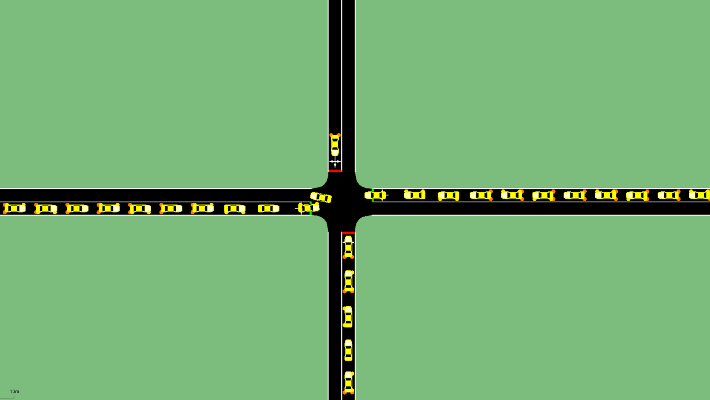

# Sumo_Projects

# Signalized Intersection Design

## Getting started

To run the simulation you need to download Eclipse SUMO (Simulation of Urban Mobility) from [eclipse](https://www.eclipse.org/sumo/) or [github](https://github.com/eclipse/sumo). The provided simulation was developed and tested with SUMO 1.19.0.

## Simulation setup

The 1h simulation currently contains routes for passenger car traffic. Both vehicle demand as well as traffic light settings are created from data for red and green light. More details on the simulation setup are provided in [simulation_setup](docs/simulation_setup.md)

Please note that while there are sidewalks on several streets the network *should not* be used for pedestrian simulation.
There are crossings missing in several places, making it disconnected.

Furthermore you should always load the WAUT mentioned in the config file because the default traffic lights are not working correctly.

## Simulation for Multiple Days

## Contributing

## Research

## Acknowledgements

## Licence

The simulation is distributed by AUDI AG and the Chair of Traffic Engineering and Control of the Technical University of Munich under the Apache License Version 2.0. SUMO is available as open source under the Eclipse Public License 2.0. For more detailled information check [LICENSE](LICENSE). 
